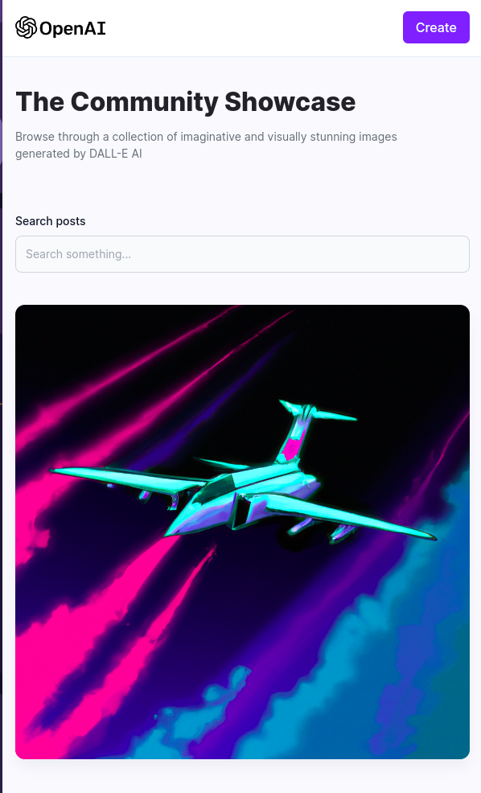

# DOLL-Y (Backend API)

## Live preview
[Click here to see the project running](https://doll-y-luluzdev.vercel.app)



## Description
Fullstack web application that implements OpenAI's DALL-E API for generating images through pompts.

## Technologies
- MongoDB
- Express
- ReactJS
- NodeJS
- Vercel (Frontend hosting)
- Render (Backend hosting)
- MongoDB Atlas (Database hosting)
- Cloudinary (Storage)
- OpenAI (LLM)

## Setup
Install project's packages using the following command:
```
npm install
```
Run project using the following command:
```
npm run dev
```
Ps: you'll need to setup **environment variable's values** (OpenAI, MongoDB, Cloudinary)